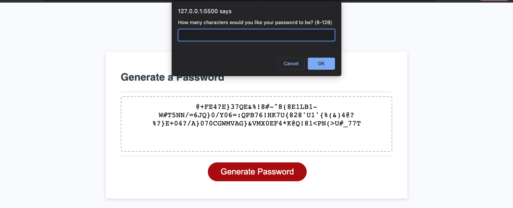

# 3CBchallengeJS

## Description

This project is a random password generator I made for my coding bootcamp class.
I did this project in collaboration Jahsper Harrell.
The website will ask for password length (from 8-128 Characters) and what kinds of characters you want. It will take these restrictions and make a password.

    

## Installation

N/A for this site

## Usage

This site is used to create a password

## Credits

N/A

## License

Refer to License in repo.